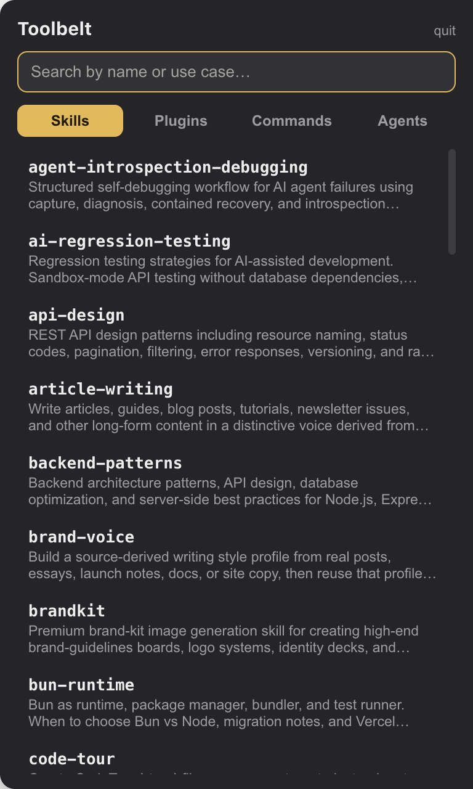
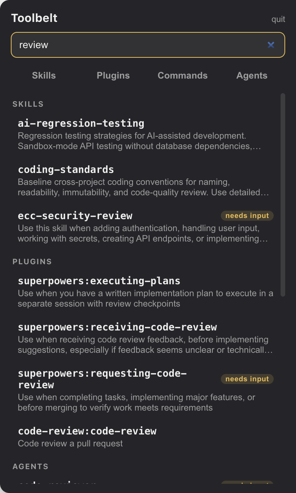
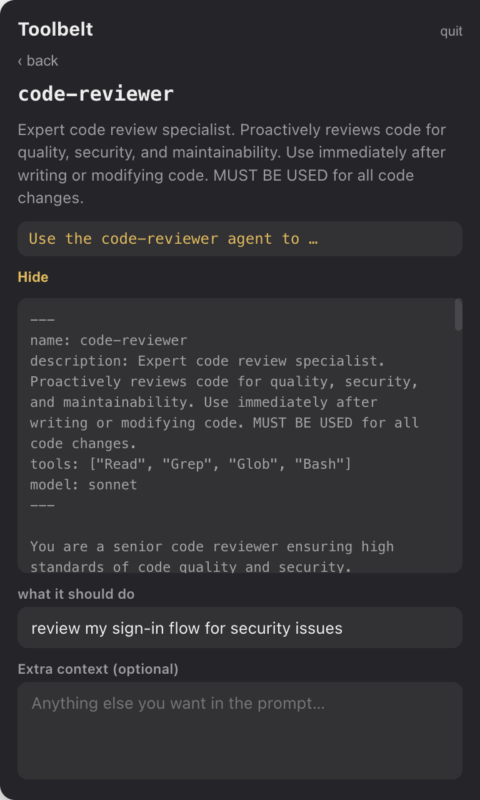

# Claude Toolbelt

A small always-on-top widget pinned to the right edge of the screen. It lists
every Claude Code skill, plugin, command and agent on this Mac, lets you search
by use case, and assembles a paste-ready prompt onto the clipboard.

Personal tool. Runs locally only, no network access. It only ever **reads**
`~/.claude` — it never writes there.

## What it looks like

| Browse | Search across everything | Prepare a prompt |
|---|---|---|
|  |  |  |

While closed, it's just a slim tab hugging the right edge of the screen
(). Regenerate these
images anytime with `node scripts/make-screenshots.mjs` (quit the widget first).

## Run it

Double-click `dist/Toolbelt-darwin-arm64/Toolbelt.app`, or from this folder:

```
npm start
```

A slim gold tab appears at the right mid edge. Hover or click to open — or
press **⌥ Option-Space** from anywhere to toggle it (change the key in
`src/main.js`, `TOGGLE_HOTKEY`). Esc or moving the mouse away closes it.
Quit with the small "quit" button in the panel.

It starts automatically at login (System Settings → General → Login Items).

Note: quit the widget before running `npm run test:e2e` — the running copy
holds the ⌥-Space hotkey, which makes the hotkey test fail.

## Use it

1. Pick a bucket (Skills / Plugins / Commands / Agents) or just search —
   search looks across everything by name and description.
2. Click an entry. Fill in any "needs input" blanks, optionally add extra
   context below. **Read more** shows the entry's full document if the
   one-line description isn't enough.
3. Hit **Copy prompt**, then paste into Claude Code and press enter.

## Wiring up your own skills

The widget has no configuration of its own — it simply reflects what Claude
Code already sees in `~/.claude`, rescanned every time the panel opens. So
"adding something to the widget" just means adding it for Claude Code:

**A skill** — create a folder with a `SKILL.md`:

```
~/.claude/skills/my-skill/SKILL.md
```

```markdown
---
name: my-skill
description: One line saying what it does and when to use it.
---

Instructions for Claude go here. Mention $ARGUMENTS where the
user's input should land.
```

**A slash command** — a single markdown file:

```
~/.claude/commands/my-command.md
```

```markdown
---
description: One line saying what it does.
argument-hint: what to type after the command
---

The prompt Claude runs. Use $ARGUMENTS (or $1, $2 for separate
blanks) where input goes.
```

**An agent** — a markdown file in `~/.claude/agents/`, same frontmatter shape.

How the widget reads these files:

- The `description` line is what search matches on, so write it as a use
  case, not a title.
- `$ARGUMENTS`, `$1`/`$2`, or an `argument-hint` is what produces the
  "needs input" badge and the fill-in blanks.
- A file with no readable frontmatter still shows up, marked
  "couldn't read details" — nothing is silently hidden.

## Set it up on your Mac

> The repo is currently private; these steps work once it's public or for
> anyone given access.

**The easy way — paste this into Claude Code:**

```text
Set up Claude Toolbelt from https://github.com/tex-mat/claude-toolbelt on this Mac:

1. Check git and Node 20+ are available; stop and tell me if not.
2. Clone the repo to ~/Projects/claude-toolbelt.
3. Run `npm install` in it (dev dependencies only: electron, @electron/packager,
   vitest, playwright).
4. Quit any running Toolbelt (it holds the Option-Space hotkey the tests
   need), then run `npm test` and show me the real output. Stop if anything fails.
5. Run `npm run package`, then open the app inside dist/ (folder name ends in
   -arm64 on Apple Silicon, -x64 on Intel) and confirm the process is running.
6. Ask me whether I want it to start at login; only if I say yes, register the
   packaged .app as a login item using a System Events osascript.

Do not install anything else, and don't touch ~/.claude — the app only reads it.
```

**The manual way:**

1. Install [Node.js](https://nodejs.org) 20 or newer.
2. `git clone https://github.com/tex-mat/claude-toolbelt ~/Projects/claude-toolbelt`
3. `cd ~/Projects/claude-toolbelt && npm install`
4. `npm test` — 28 unit tests and 7 app tests should pass.
5. `npm run package`
6. Open `dist/Toolbelt-darwin-arm64/Toolbelt.app` (or `-x64` on Intel).
7. Optional, start at login: System Settings → General → Login Items → “+” →
   pick the app.

## Files

- `src/main.js` — the app window (position, always-on-top, clipboard, quit)
- `src/preload.js` — the narrow bridge between the window and the UI
- `src/lib/scan.js` — reads skills/commands/agents from `~/.claude` (read-only)
- `src/lib/assemble.js` — builds the copied prompt text
- `src/renderer/` — the panel UI (HTML/CSS/JS, no frameworks)
- `tests/unit/` — Vitest tests for scanning and prompt assembly
- `tests/e2e/` — Playwright tests that drive the real app against fixture data

## Tests

```
npm test          # everything
npm run test:unit
npm run test:e2e
```

## Rebuild the app after changes

```
npm run package
```
